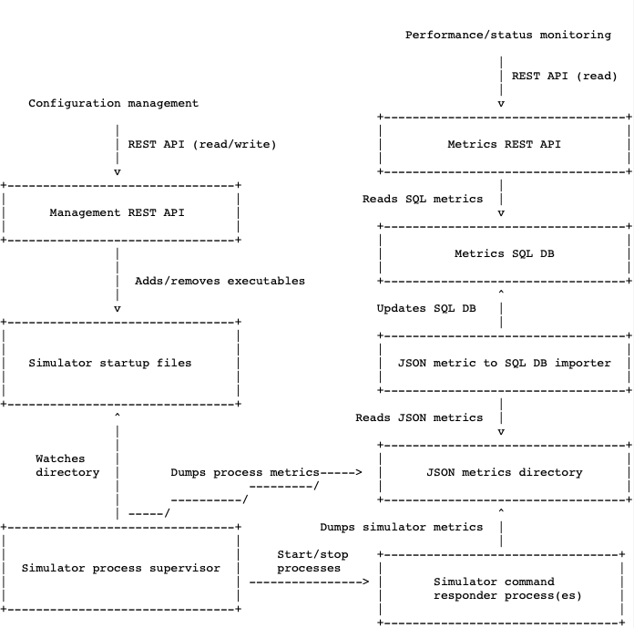

Architecture
------------

The overall system architecture is depicted on the following
high-level diagram:

Technically, the system consists of a handful of daemons and WSGI
applications. Let's examine the roles of the main ones:

REST API server
+++++++++++++++

The `snmpsim-mgmt-restapi` tool is a WSGI application implementing
Management API server. Also known as
`snmpsim_control_plane.wsgi.management:app` when run under a WSGI server.

In response to management operations, `snmpsim-mgmt-restapi` tool will
generate (or remove) one or more executable scripts designed to invoke
SNMP Simulator Command Responder instances.

For example, for a simple configuration such script would looks like this:

.. code-block:: bash

    $ cat /tmp/snmpsim-run-labs.sh
    #!/bin/bash
    #
    # SNMP Simulator Command Responder invocation script
    # Automatically generated from REST API DB data - do not edit!
    #
    exec snmpsim-command-responder \
        --v3-engine-id "auto" \
          --v3-user "simulator" \
          --agent-udpv4-endpoint "127.0.0.1:1161" \
          --data-dir "data"

Process supervisor
++++++++++++++++++

One or more SNMP Simulator Command Responder instances are invoked, kept
running and eventually killed by `snmpsim-mgmt-supervisor` tool.

The supervisor tool is driven by the executable scripts dis/appearing in a
dedicated directory due to `snmpsim-mgmt-restapi` tool operations.
Disappearance of the executable in the watched directory will lead to
corresponding `snmpsim-command-responder` process termination.

Metrics REST API server
+++++++++++++++++++++++

The `snmpsim-metrics-restapi` tool is another WSGI application
implementing Metrics API server. Also known as
`snmpsim_control_plane.wsgi.metrics:app` when run under a WSGI server.

This tool is responsible for querying its underlying SQL DB to fulfill
REST API queries for metrics.

Metrics importer
++++++++++++++++

The job of `snmpsim-metrics-importer` tool is to collect metrics files,
being generated by `snmpsim-command-responder` and `snmpsim-mgmt-supervisor`
tools. and upload them into the SQL DB for `snmpsim-metrics-restapi` tool
to consume.

Ultimately, `snmpsim-metrics-restapi` server exposes metrics in SQL DB to
REST API clients.

